# Activity Diagram Aplikasi Hafalan Qur'an

Dokumen ini dibuat dari alur yang saat ini benar-benar ada di source Flutter. Setiap fitur dipisahkan agar mudah dipindahkan atau digambar ulang di FigJam/Figma. Diagram menggunakan notasi aktivitas: lingkaran untuk mulai/selesai, kotak untuk aktivitas, dan belah ketupat untuk keputusan.

## Daftar diagram

1. [Inisialisasi aplikasi dan pemeriksaan sesi](#ad-00-inisialisasi-aplikasi-dan-pemeriksaan-sesi)
2. [Login admin](#ad-01-login-admin)
3. [Login ustadz](#ad-02-login-ustadz)
4. [Login orang tua](#ad-03-login-orang-tua)
5. [Dashboard admin](#ad-04-dashboard-admin)
6. [Tambah dan edit santri](#ad-05-tambah-dan-edit-santri)
7. [Kelola relasi dan akun orang tua](#ad-05b-kelola-relasi-dan-akun-orang-tua)
8. [Lihat detail santri](#ad-06-lihat-detail-santri)
9. [Hapus santri](#ad-07-hapus-santri)
10. [Kelola daftar ustadz](#ad-08-kelola-daftar-ustadz)
11. [Tambah akun ustadz](#ad-09-tambah-akun-ustadz)
12. [Detail dan edit ustadz](#ad-10-detail-dan-edit-ustadz)
13. [Hapus akun ustadz](#ad-11-hapus-akun-ustadz)
14. [Dashboard ustadz dan pencarian santri](#ad-12-dashboard-ustadz-dan-pencarian-santri)
15. [Input setoran dan rekaman audio](#ad-13-input-setoran-dan-rekaman-audio)
16. [Lihat riwayat dan putar audio setoran](#ad-14-lihat-riwayat-dan-putar-audio-setoran)
17. [Penilaian dan perubahan status setoran](#ad-15-penilaian-dan-perubahan-status-setoran)
18. [Hapus audio atau setoran](#ad-16-hapus-audio-atau-setoran)
19. [Update progress hafalan](#ad-17-update-progress-hafalan)
20. [Kelola target hafalan](#ad-18-kelola-target-hafalan)
21. [Dashboard orang tua dan notifikasi](#ad-19-dashboard-orang-tua-dan-notifikasi)
22. [Riwayat, grafik, dan audio untuk orang tua](#ad-20-riwayat-grafik-dan-audio-untuk-orang-tua)
23. [Progress hafalan untuk orang tua](#ad-21-progress-hafalan-untuk-orang-tua)
24. [Profil dan foto profil](#ad-22-profil-dan-foto-profil)
25. [Ganti password](#ad-23-ganti-password)
26. [Logout](#ad-24-logout)

## AD-00: Inisialisasi aplikasi dan pemeriksaan sesi

Sumber alur: `lib/main.dart`, `lib/services/notification_service.dart`.

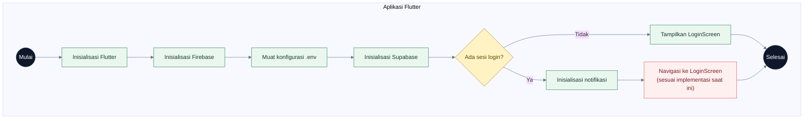
```mermaid
%%{init: {'theme': 'base', 'themeVariables': {'fontFamily': 'Inter', 'lineColor': '#64748B'}}}%%
flowchart TB
  subgraph app["Aplikasi Flutter"]
    start((Mulai)) --> init["Inisialisasi Flutter"]
    init --> firebase["Inisialisasi Firebase"]
    firebase --> env["Muat konfigurasi .env"]
    env --> supa["Inisialisasi Supabase"]
    supa --> session{"Ada sesi login?"}
    session -- "Tidak" --> login["Tampilkan LoginScreen"]
    session -- "Ya" --> notif["Inisialisasi notifikasi"]
    notif --> existing["Navigasi ke LoginScreen<br/>(sesuai implementasi saat ini)"]
    login --> finish((Selesai))
    existing --> finish
  end

  classDef start fill:#0F172A,stroke:#0F172A,color:#FFFFFF;
  classDef terminal fill:#0F172A,stroke:#0F172A,color:#FFFFFF;
  classDef action fill:#EAF7EE,stroke:#2F855A,color:#163A2A;
  classDef decision fill:#FFF3C4,stroke:#B7791F,color:#5F4500;
  classDef note fill:#FFF0F0,stroke:#E05A5A,color:#7A1E1E;
  class start start;
  class finish terminal;
  class init,firebase,env,supa,notif,login action;
  class session decision;
  class existing note;
```

## AD-01: Login admin

Sumber alur: `lib/screens/auth/login_screen.dart` -> `AdminHomeScreen`.

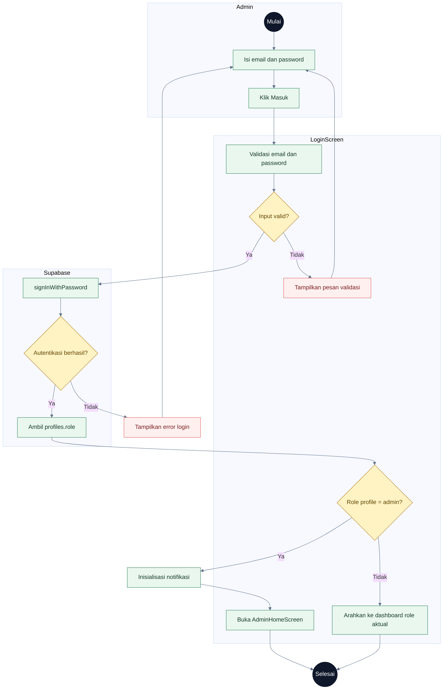
```mermaid
%%{init: {'theme': 'base', 'themeVariables': {'fontFamily': 'Inter', 'lineColor': '#64748B'}}}%%
flowchart TB
  subgraph actor["Admin"]
    start((Mulai)) --> input["Isi email dan password"]
    input --> tap["Klik Masuk"]
  end
  subgraph app["LoginScreen"]
    validate["Validasi email dan password"]
    valid{"Input valid?"}
    invalid["Tampilkan pesan validasi"]
    route{"Role profile = admin?"}
    home["Buka AdminHomeScreen"]
    other["Arahkan ke dashboard role aktual"]
  end
  subgraph backend["Supabase"]
    auth["signInWithPassword"]
    authOk{"Autentikasi berhasil?"}
    profile["Ambil profiles.role"]
  end

  tap --> validate --> valid
  valid -- "Tidak" --> invalid --> input
  valid -- "Ya" --> auth --> authOk
  authOk -- "Tidak" --> error["Tampilkan error login"] --> input
  authOk -- "Ya" --> profile --> route
  route -- "Ya" --> notif["Inisialisasi notifikasi"] --> home --> finish((Selesai))
  route -- "Tidak" --> other --> finish

  classDef start fill:#0F172A,stroke:#0F172A,color:#FFFFFF;
  classDef terminal fill:#0F172A,stroke:#0F172A,color:#FFFFFF;
  classDef action fill:#EAF7EE,stroke:#2F855A,color:#163A2A;
  classDef decision fill:#FFF3C4,stroke:#B7791F,color:#5F4500;
  classDef error fill:#FFF0F0,stroke:#E05A5A,color:#7A1E1E;
  class start start;
  class finish terminal;
  class input,tap,validate,auth,profile,notif,home,other action;
  class valid,authOk,route decision;
  class invalid,error error;
```

## AD-02: Login ustadz

Sumber alur: `lib/screens/auth/login_screen.dart` -> `UstadzHomeScreen`.

```mermaid
%%{init: {'theme': 'base', 'themeVariables': {'fontFamily': 'Inter', 'lineColor': '#64748B'}}}%%
flowchart TB
  subgraph actor["Ustadz"]
    start((Mulai)) --> input["Isi email dan password"]
    input --> tap["Klik Masuk"]
  end
  subgraph app["LoginScreen"]
    validate["Validasi email dan password"]
    valid{"Input valid?"}
    invalid["Tampilkan pesan validasi"]
    route{"Role profile = ustadz?"}
    home["Buka UstadzHomeScreen"]
    other["Arahkan ke dashboard role aktual"]
  end
  subgraph backend["Supabase"]
    auth["signInWithPassword"]
    authOk{"Autentikasi berhasil?"}
    profile["Ambil profiles.role"]
  end

  tap --> validate --> valid
  valid -- "Tidak" --> invalid --> input
  valid -- "Ya" --> auth --> authOk
  authOk -- "Tidak" --> error["Tampilkan error login"] --> input
  authOk -- "Ya" --> profile --> route
  route -- "Ya" --> notif["Inisialisasi notifikasi"] --> home --> finish((Selesai))
  route -- "Tidak" --> other --> finish

  classDef start fill:#0F172A,stroke:#0F172A,color:#FFFFFF;
  classDef terminal fill:#0F172A,stroke:#0F172A,color:#FFFFFF;
  classDef action fill:#EAF7EE,stroke:#2F855A,color:#163A2A;
  classDef decision fill:#FFF3C4,stroke:#B7791F,color:#5F4500;
  classDef error fill:#FFF0F0,stroke:#E05A5A,color:#7A1E1E;
  class start start;
  class finish terminal;
  class input,tap,validate,auth,profile,notif,home,other action;
  class valid,authOk,route decision;
  class invalid,error error;
```

## AD-03: Login orang tua

Sumber alur: `lib/screens/auth/login_screen.dart` -> `OrangTuaHomeScreen`.

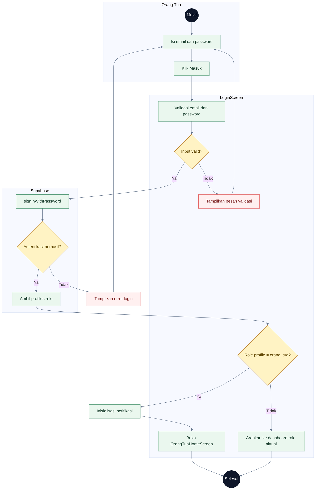
```mermaid
%%{init: {'theme': 'base', 'themeVariables': {'fontFamily': 'Inter', 'lineColor': '#64748B'}}}%%
flowchart TB
  subgraph actor["Orang Tua"]
    start((Mulai)) --> input["Isi email dan password"]
    input --> tap["Klik Masuk"]
  end
  subgraph app["LoginScreen"]
    validate["Validasi email dan password"]
    valid{"Input valid?"}
    invalid["Tampilkan pesan validasi"]
    route{"Role profile = orang_tua?"}
    home["Buka OrangTuaHomeScreen"]
    other["Arahkan ke dashboard role aktual"]
  end
  subgraph backend["Supabase"]
    auth["signInWithPassword"]
    authOk{"Autentikasi berhasil?"}
    profile["Ambil profiles.role"]
  end

  tap --> validate --> valid
  valid -- "Tidak" --> invalid --> input
  valid -- "Ya" --> auth --> authOk
  authOk -- "Tidak" --> error["Tampilkan error login"] --> input
  authOk -- "Ya" --> profile --> route
  route -- "Ya" --> notif["Inisialisasi notifikasi"] --> home --> finish((Selesai))
  route -- "Tidak" --> other --> finish

  classDef start fill:#0F172A,stroke:#0F172A,color:#FFFFFF;
  classDef terminal fill:#0F172A,stroke:#0F172A,color:#FFFFFF;
  classDef action fill:#EAF7EE,stroke:#2F855A,color:#163A2A;
  classDef decision fill:#FFF3C4,stroke:#B7791F,color:#5F4500;
  classDef error fill:#FFF0F0,stroke:#E05A5A,color:#7A1E1E;
  class start start;
  class finish terminal;
  class input,tap,validate,auth,profile,notif,home,other action;
  class valid,authOk,route decision;
  class invalid,error error;
```

## AD-04: Dashboard admin

Sumber alur: `lib/screens/admin/home_screen.dart`.

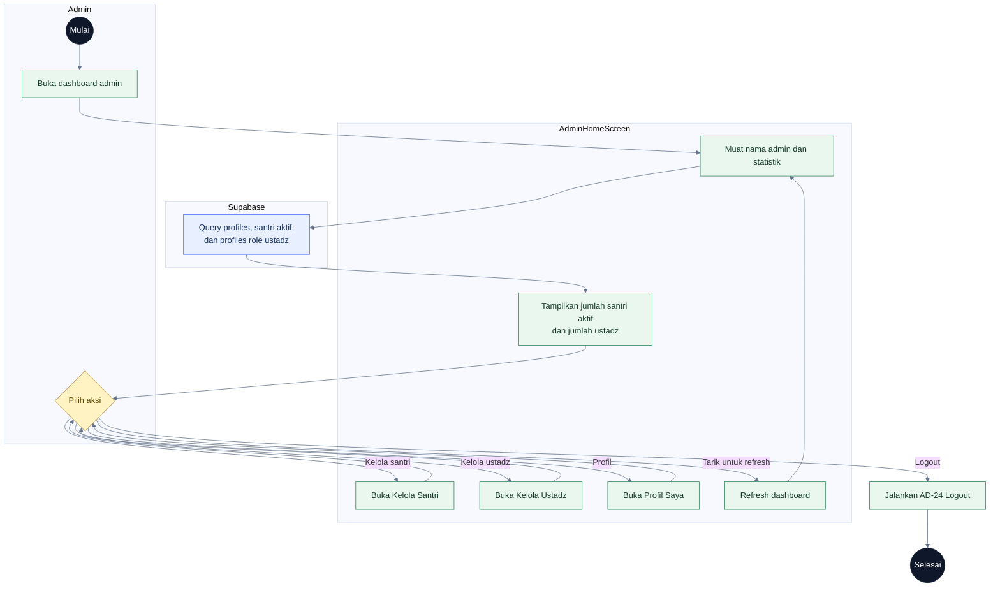
```mermaid
%%{init: {'theme': 'base', 'themeVariables': {'fontFamily': 'Inter', 'lineColor': '#64748B'}}}%%
flowchart TB
  subgraph actor["Admin"]
    start((Mulai)) --> open["Buka dashboard admin"]
    action{"Pilih aksi"}
  end
  subgraph app["AdminHomeScreen"]
    load["Muat nama admin dan statistik"]
    show["Tampilkan jumlah santri aktif<br/>dan jumlah ustadz"]
    santri["Buka Kelola Santri"]
    ustadz["Buka Kelola Ustadz"]
    profile["Buka Profil Saya"]
    refresh["Refresh dashboard"]
  end
  subgraph backend["Supabase"]
    query["Query profiles, santri aktif,<br/>dan profiles role ustadz"]
  end

  open --> load --> query --> show --> action
  action -- "Kelola santri" --> santri --> action
  action -- "Kelola ustadz" --> ustadz --> action
  action -- "Profil" --> profile --> action
  action -- "Tarik untuk refresh" --> refresh --> load
  action -- "Logout" --> logout["Jalankan AD-24 Logout"] --> finish((Selesai))

  classDef start fill:#0F172A,stroke:#0F172A,color:#FFFFFF;
  classDef terminal fill:#0F172A,stroke:#0F172A,color:#FFFFFF;
  classDef action fill:#EAF7EE,stroke:#2F855A,color:#163A2A;
  classDef decision fill:#FFF3C4,stroke:#B7791F,color:#5F4500;
  classDef data fill:#E8F0FF,stroke:#4C6FFF,color:#17315F;
  class start start;
  class finish terminal;
  class open,load,show,santri,ustadz,profile,refresh,logout action;
  class action decision;
  class query data;
```

## AD-05: Tambah dan edit santri

Sumber alur: `lib/screens/admin/kelola_santri_screen.dart` (`FormSantriScreen`).

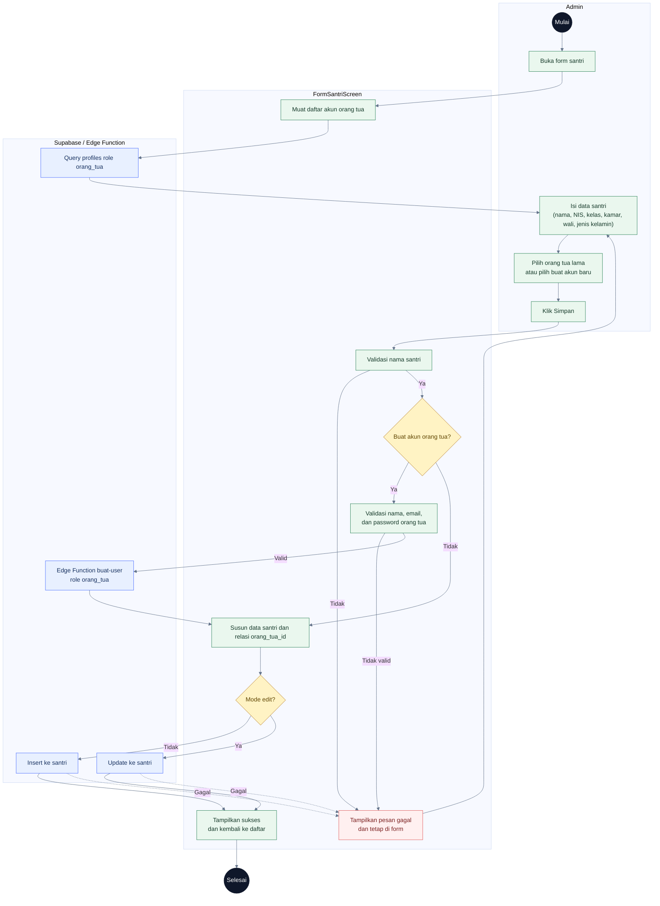
```mermaid
%%{init: {'theme': 'base', 'themeVariables': {'fontFamily': 'Inter', 'lineColor': '#64748B'}}}%%
flowchart TB
  subgraph actor["Admin"]
    start((Mulai)) --> open["Buka form santri"]
    fill["Isi data santri<br/>(nama, NIS, kelas, kamar, wali, jenis kelamin)"]
    parent["Pilih orang tua lama<br/>atau pilih buat akun baru"]
    save["Klik Simpan"]
  end
  subgraph app["FormSantriScreen"]
    loadParent["Muat daftar akun orang tua"]
    validate["Validasi nama santri"]
    parentValid{"Buat akun orang tua?"}
    parentCheck["Validasi nama, email,<br/>dan password orang tua"]
    formData["Susun data santri dan relasi orang_tua_id"]
    mode{"Mode edit?"}
    success["Tampilkan sukses<br/>dan kembali ke daftar"]
    error["Tampilkan pesan gagal<br/>dan tetap di form"]
  end
  subgraph backend["Supabase / Edge Function"]
    list["Query profiles role orang_tua"]
    createParent["Edge Function buat-user<br/>role orang_tua"]
    insert["Insert ke santri"]
    update["Update ke santri"]
  end

  open --> loadParent --> list --> fill --> parent --> save --> validate
  validate -- "Tidak" --> error --> fill
  validate -- "Ya" --> parentValid
  parentValid -- "Ya" --> parentCheck
  parentCheck -- "Tidak valid" --> error
  parentCheck -- "Valid" --> createParent --> formData
  parentValid -- "Tidak" --> formData
  formData --> mode
  mode -- "Tidak" --> insert --> success --> finish((Selesai))
  mode -- "Ya" --> update --> success
  insert -. "Gagal" .-> error
  update -. "Gagal" .-> error

  classDef start fill:#0F172A,stroke:#0F172A,color:#FFFFFF;
  classDef terminal fill:#0F172A,stroke:#0F172A,color:#FFFFFF;
  classDef action fill:#EAF7EE,stroke:#2F855A,color:#163A2A;
  classDef decision fill:#FFF3C4,stroke:#B7791F,color:#5F4500;
  classDef data fill:#E8F0FF,stroke:#4C6FFF,color:#17315F;
  classDef error fill:#FFF0F0,stroke:#E05A5A,color:#7A1E1E;
  class start start;
  class finish terminal;
  class open,fill,parent,save,loadParent,validate,parentCheck,formData,success action;
  class parentValid,mode decision;
  class list,createParent,insert,update data;
class error error;
```

## AD-05B: Kelola relasi dan akun orang tua

Sumber alur: `lib/screens/admin/kelola_santri_screen.dart` (`FormSantriScreen`).

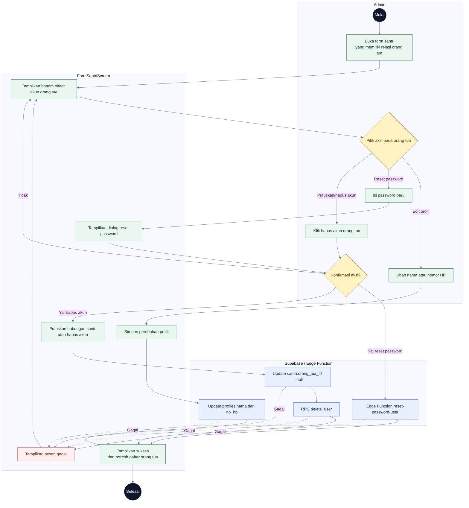
```mermaid
%%{init: {'theme': 'base', 'themeVariables': {'fontFamily': 'Inter', 'lineColor': '#64748B'}}}%%
flowchart TB
  subgraph actor["Admin"]
    start((Mulai)) --> open["Buka form santri<br/>yang memiliki relasi orang tua"]
    action{"Pilih aksi pada orang tua"}
    edit["Ubah nama atau nomor HP"]
    reset["Isi password baru"]
    delete["Klik hapus akun orang tua"]
    confirm{"Konfirmasi aksi?"}
  end
  subgraph app["FormSantriScreen"]
    sheet["Tampilkan bottom sheet akun orang tua"]
    save["Simpan perubahan profil"]
    resetConfirm["Tampilkan dialog reset password"]
    unlink["Putuskan hubungan santri<br/>atau hapus akun"]
    success["Tampilkan sukses<br/>dan refresh daftar orang tua"]
    error["Tampilkan pesan gagal"]
  end
  subgraph backend["Supabase / Edge Function"]
    updateProfile["Update profiles.nama dan no_hp"]
    resetPassword["Edge Function reset-password-user"]
    clearRelation["Update santri.orang_tua_id = null"]
    deleteUser["RPC delete_user"]
  end

  open --> sheet --> action
  action -- "Edit profil" --> edit --> save --> updateProfile --> success --> finish((Selesai))
  action -- "Reset password" --> reset --> resetConfirm --> confirm
  action -- "Putuskan/hapus akun" --> delete --> confirm
  confirm -- "Tidak" --> sheet
  confirm -- "Ya: reset password" --> resetPassword --> success
  confirm -- "Ya: hapus akun" --> unlink --> clearRelation --> deleteUser --> success
  updateProfile -. "Gagal" .-> error --> sheet
  resetPassword -. "Gagal" .-> error
  clearRelation -. "Gagal" .-> error
  deleteUser -. "Gagal" .-> error

  classDef start fill:#0F172A,stroke:#0F172A,color:#FFFFFF;
  classDef terminal fill:#0F172A,stroke:#0F172A,color:#FFFFFF;
  classDef action fill:#EAF7EE,stroke:#2F855A,color:#163A2A;
  classDef decision fill:#FFF3C4,stroke:#B7791F,color:#5F4500;
  classDef data fill:#E8F0FF,stroke:#4C6FFF,color:#17315F;
  classDef error fill:#FFF0F0,stroke:#E05A5A,color:#7A1E1E;
  class start start;
  class finish terminal;
  class open,edit,reset,delete,sheet,save,resetConfirm,unlink,success action;
  class action,confirm decision;
  class updateProfile,resetPassword,clearRelation,deleteUser data;
  class error error;
```

## AD-06: Lihat detail santri

Sumber alur: `lib/screens/admin/detail_santri_screen.dart`.

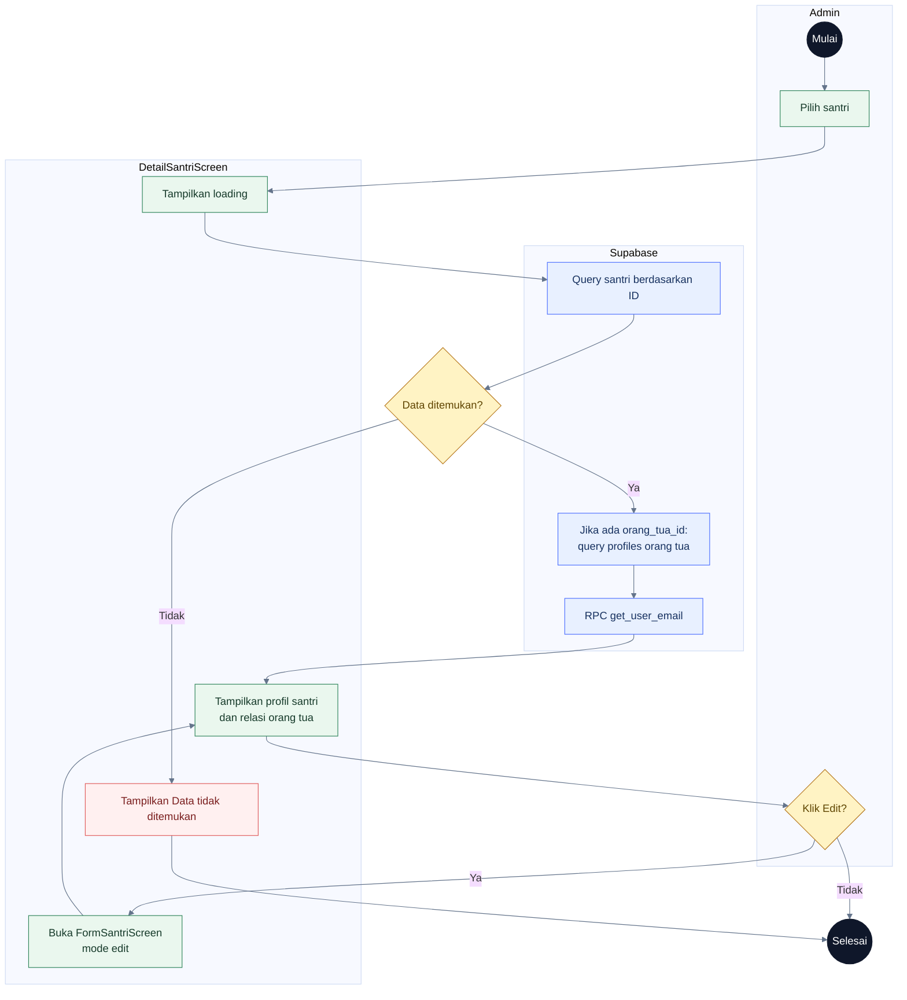
```mermaid
%%{init: {'theme': 'base', 'themeVariables': {'fontFamily': 'Inter', 'lineColor': '#64748B'}}}%%
flowchart TB
  subgraph actor["Admin"]
    start((Mulai)) --> select["Pilih santri"]
    edit{"Klik Edit?"}
  end
  subgraph app["DetailSantriScreen"]
    loading["Tampilkan loading"]
    display["Tampilkan profil santri<br/>dan relasi orang tua"]
    notFound["Tampilkan Data tidak ditemukan"]
    form["Buka FormSantriScreen<br/>mode edit"]
  end
  subgraph backend["Supabase"]
    santri["Query santri berdasarkan ID"]
    parentQ["Jika ada orang_tua_id:<br/>query profiles orang tua"]
    email["RPC get_user_email"]
  end

  select --> loading --> santri --> found{"Data ditemukan?"}
  found -- "Tidak" --> notFound --> finish((Selesai))
  found -- "Ya" --> parentQ --> email --> display --> edit
  edit -- "Ya" --> form --> display
  edit -- "Tidak" --> finish

  classDef start fill:#0F172A,stroke:#0F172A,color:#FFFFFF;
  classDef terminal fill:#0F172A,stroke:#0F172A,color:#FFFFFF;
  classDef action fill:#EAF7EE,stroke:#2F855A,color:#163A2A;
  classDef decision fill:#FFF3C4,stroke:#B7791F,color:#5F4500;
  classDef data fill:#E8F0FF,stroke:#4C6FFF,color:#17315F;
  classDef error fill:#FFF0F0,stroke:#E05A5A,color:#7A1E1E;
  class start start;
  class finish terminal;
  class select,loading,display,form action;
  class found,edit decision;
  class santri,parentQ,email data;
  class notFound error;
```

## AD-07: Hapus santri

Sumber alur: `lib/screens/admin/kelola_santri_screen.dart` (`_hapusSantri`).

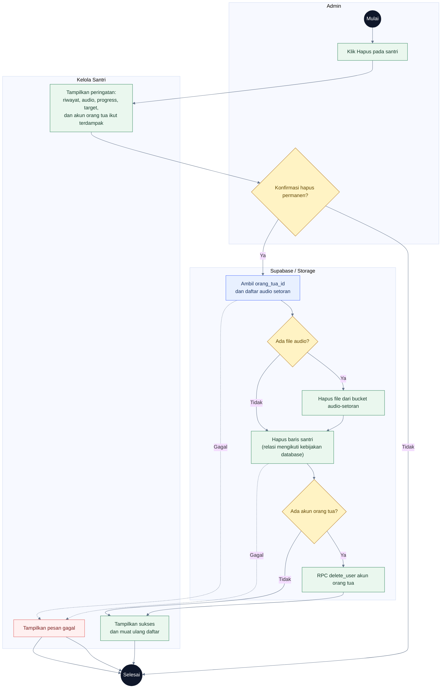
```mermaid
%%{init: {'theme': 'base', 'themeVariables': {'fontFamily': 'Inter', 'lineColor': '#64748B'}}}%%
flowchart TB
  subgraph actor["Admin"]
    start((Mulai)) --> choose["Klik Hapus pada santri"]
    confirm{"Konfirmasi hapus permanen?"}
  end
  subgraph app["Kelola Santri"]
    warning["Tampilkan peringatan:<br/>riwayat, audio, progress, target,<br/>dan akun orang tua ikut terdampak"]
    reload["Tampilkan sukses<br/>dan muat ulang daftar"]
    fail["Tampilkan pesan gagal"]
  end
  subgraph backend["Supabase / Storage"]
    relation["Ambil orang_tua_id<br/>dan daftar audio setoran"]
    audio{"Ada file audio?"}
    remove["Hapus file dari bucket audio-setoran"]
    deleteSantri["Hapus baris santri<br/>(relasi mengikuti kebijakan database)"]
    parent{"Ada akun orang tua?"}
    deleteParent["RPC delete_user akun orang tua"]
  end

  choose --> warning --> confirm
  confirm -- "Tidak" --> finish((Selesai))
  confirm -- "Ya" --> relation --> audio
  audio -- "Ya" --> remove --> deleteSantri
  audio -- "Tidak" --> deleteSantri
  deleteSantri --> parent
  parent -- "Ya" --> deleteParent --> reload --> finish
  parent -- "Tidak" --> reload
  relation -. "Gagal" .-> fail --> finish
  deleteSantri -. "Gagal" .-> fail --> finish

  classDef start fill:#0F172A,stroke:#0F172A,color:#FFFFFF;
  classDef terminal fill:#0F172A,stroke:#0F172A,color:#FFFFFF;
  classDef action fill:#EAF7EE,stroke:#2F855A,color:#163A2A;
  classDef decision fill:#FFF3C4,stroke:#B7791F,color:#5F4500;
  classDef data fill:#E8F0FF,stroke:#4C6FFF,color:#17315F;
  classDef error fill:#FFF0F0,stroke:#E05A5A,color:#7A1E1E;
  class start start;
  class finish terminal;
  class choose,warning,reload,remove,deleteSantri,deleteParent action;
  class confirm,audio,parent decision;
  class relation data;
  class fail error;
```

## AD-08: Kelola daftar ustadz

Sumber alur: `lib/screens/admin/kelola_ustadz_screen.dart`.

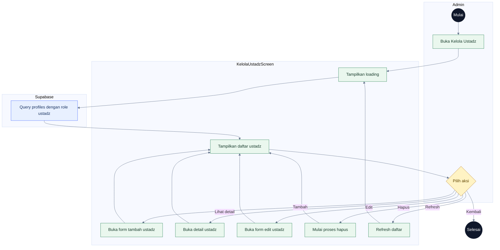
```mermaid
%%{init: {'theme': 'base', 'themeVariables': {'fontFamily': 'Inter', 'lineColor': '#64748B'}}}%%
flowchart TB
  subgraph actor["Admin"]
    start((Mulai)) --> open["Buka Kelola Ustadz"]
    action{"Pilih aksi"}
  end
  subgraph app["KelolaUstadzScreen"]
    load["Tampilkan loading"]
    list["Tampilkan daftar ustadz"]
    add["Buka form tambah ustadz"]
    detail["Buka detail ustadz"]
    edit["Buka form edit ustadz"]
    delete["Mulai proses hapus"]
    refresh["Refresh daftar"]
  end
  subgraph backend["Supabase"]
    query["Query profiles dengan role ustadz"]
  end

  open --> load --> query --> list --> action
  action -- "Tambah" --> add --> list
  action -- "Lihat detail" --> detail --> list
  action -- "Edit" --> edit --> list
  action -- "Hapus" --> delete --> list
  action -- "Refresh" --> refresh --> load
  action -- "Kembali" --> finish((Selesai))

  classDef start fill:#0F172A,stroke:#0F172A,color:#FFFFFF;
  classDef terminal fill:#0F172A,stroke:#0F172A,color:#FFFFFF;
  classDef action fill:#EAF7EE,stroke:#2F855A,color:#163A2A;
  classDef decision fill:#FFF3C4,stroke:#B7791F,color:#5F4500;
  classDef data fill:#E8F0FF,stroke:#4C6FFF,color:#17315F;
  class start start;
  class finish terminal;
  class open,load,list,add,detail,edit,delete,refresh action;
  class action decision;
  class query data;
```

## AD-09: Tambah akun ustadz

Sumber alur: `lib/screens/admin/form_user_screen.dart` (`role: ustadz`).

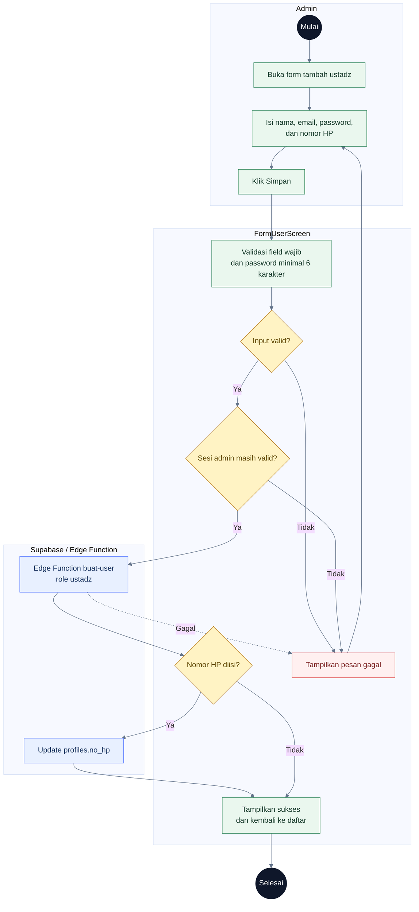
```mermaid
%%{init: {'theme': 'base', 'themeVariables': {'fontFamily': 'Inter', 'lineColor': '#64748B'}}}%%
flowchart TB
  subgraph actor["Admin"]
    start((Mulai)) --> open["Buka form tambah ustadz"]
    fill["Isi nama, email, password,<br/>dan nomor HP"]
    save["Klik Simpan"]
  end
  subgraph app["FormUserScreen"]
    validate["Validasi field wajib<br/>dan password minimal 6 karakter"]
    valid{"Input valid?"}
    session{"Sesi admin masih valid?"}
    updatePhone{"Nomor HP diisi?"}
    success["Tampilkan sukses<br/>dan kembali ke daftar"]
    error["Tampilkan pesan gagal"]
  end
  subgraph backend["Supabase / Edge Function"]
    create["Edge Function buat-user<br/>role ustadz"]
    profile["Update profiles.no_hp"]
  end

  open --> fill --> save --> validate --> valid
  valid -- "Tidak" --> error --> fill
  valid -- "Ya" --> session
  session -- "Tidak" --> error
  session -- "Ya" --> create --> updatePhone
  updatePhone -- "Ya" --> profile --> success --> finish((Selesai))
  updatePhone -- "Tidak" --> success
  create -. "Gagal" .-> error

  classDef start fill:#0F172A,stroke:#0F172A,color:#FFFFFF;
  classDef terminal fill:#0F172A,stroke:#0F172A,color:#FFFFFF;
  classDef action fill:#EAF7EE,stroke:#2F855A,color:#163A2A;
  classDef decision fill:#FFF3C4,stroke:#B7791F,color:#5F4500;
  classDef data fill:#E8F0FF,stroke:#4C6FFF,color:#17315F;
  classDef error fill:#FFF0F0,stroke:#E05A5A,color:#7A1E1E;
  class start start;
  class finish terminal;
  class open,fill,save,validate,success action;
  class valid,session,updatePhone decision;
  class create,profile data;
  class error error;
```

## AD-10: Detail dan edit ustadz

Sumber alur: `lib/screens/admin/detail_ustadz_screen.dart`, `lib/screens/admin/kelola_ustadz_screen.dart` (`EditUstadzSheet`).

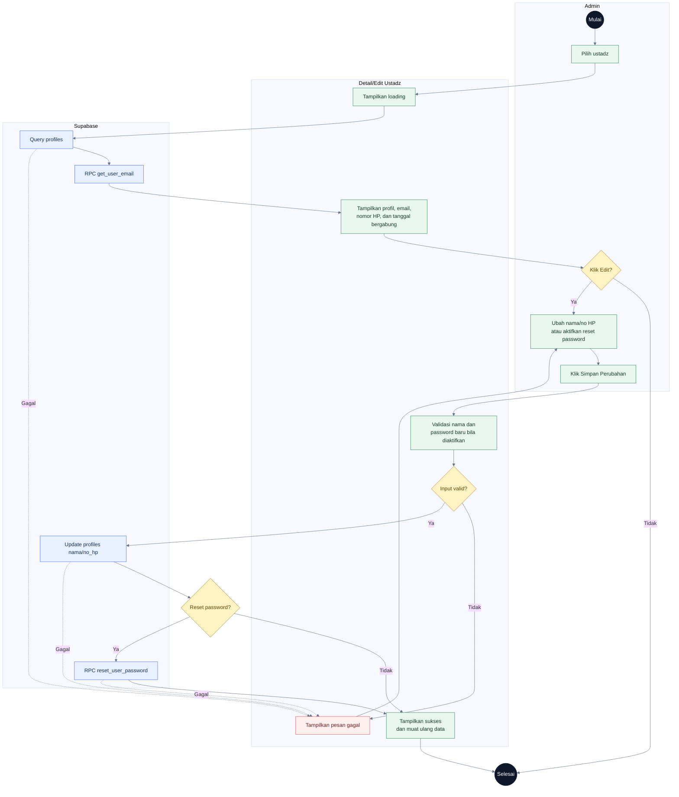
```mermaid
%%{init: {'theme': 'base', 'themeVariables': {'fontFamily': 'Inter', 'lineColor': '#64748B'}}}%%
flowchart TB
  subgraph actor["Admin"]
    start((Mulai)) --> select["Pilih ustadz"]
    edit{"Klik Edit?"}
    fields["Ubah nama/no HP<br/>atau aktifkan reset password"]
    save["Klik Simpan Perubahan"]
  end
  subgraph app["Detail/Edit Ustadz"]
    loading["Tampilkan loading"]
    display["Tampilkan profil, email,<br/>nomor HP, dan tanggal bergabung"]
    validate["Validasi nama dan<br/>password baru bila diaktifkan"]
    valid{"Input valid?"}
    success["Tampilkan sukses<br/>dan muat ulang data"]
    error["Tampilkan pesan gagal"]
  end
  subgraph backend["Supabase"]
    profile["Query profiles"]
    email["RPC get_user_email"]
    update["Update profiles nama/no_hp"]
    reset["RPC reset_user_password"]
  end

  select --> loading --> profile --> email --> display --> edit
  edit -- "Tidak" --> finish((Selesai))
  edit -- "Ya" --> fields --> save --> validate --> valid
  valid -- "Tidak" --> error --> fields
  valid -- "Ya" --> update --> resetChoice{"Reset password?"}
  resetChoice -- "Ya" --> reset --> success --> finish
  resetChoice -- "Tidak" --> success
  profile -. "Gagal" .-> error
  update -. "Gagal" .-> error
  reset -. "Gagal" .-> error

  classDef start fill:#0F172A,stroke:#0F172A,color:#FFFFFF;
  classDef terminal fill:#0F172A,stroke:#0F172A,color:#FFFFFF;
  classDef action fill:#EAF7EE,stroke:#2F855A,color:#163A2A;
  classDef decision fill:#FFF3C4,stroke:#B7791F,color:#5F4500;
  classDef data fill:#E8F0FF,stroke:#4C6FFF,color:#17315F;
  classDef error fill:#FFF0F0,stroke:#E05A5A,color:#7A1E1E;
  class start start;
  class finish terminal;
  class select,fields,save,loading,display,validate,success action;
  class edit,valid,resetChoice decision;
  class profile,email,update,reset data;
  class error error;
```

## AD-11: Hapus akun ustadz

Sumber alur: `lib/screens/admin/kelola_ustadz_screen.dart` (`_hapus`).

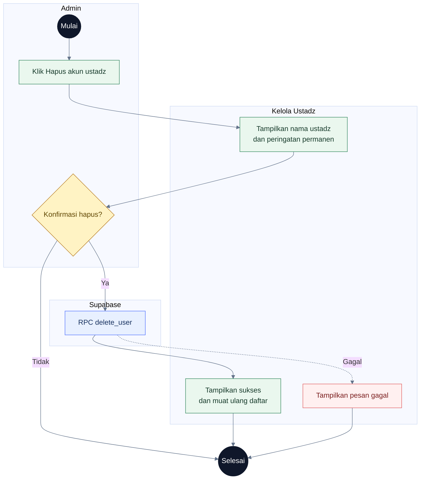
```mermaid
%%{init: {'theme': 'base', 'themeVariables': {'fontFamily': 'Inter', 'lineColor': '#64748B'}}}%%
flowchart TB
  subgraph actor["Admin"]
    start((Mulai)) --> choose["Klik Hapus akun ustadz"]
    confirm{"Konfirmasi hapus?"}
  end
  subgraph app["Kelola Ustadz"]
    warning["Tampilkan nama ustadz<br/>dan peringatan permanen"]
    success["Tampilkan sukses<br/>dan muat ulang daftar"]
    error["Tampilkan pesan gagal"]
  end
  subgraph backend["Supabase"]
    delete["RPC delete_user"]
  end

  choose --> warning --> confirm
  confirm -- "Tidak" --> finish((Selesai))
  confirm -- "Ya" --> delete --> success --> finish
  delete -. "Gagal" .-> error --> finish

  classDef start fill:#0F172A,stroke:#0F172A,color:#FFFFFF;
  classDef terminal fill:#0F172A,stroke:#0F172A,color:#FFFFFF;
  classDef action fill:#EAF7EE,stroke:#2F855A,color:#163A2A;
  classDef decision fill:#FFF3C4,stroke:#B7791F,color:#5F4500;
  classDef data fill:#E8F0FF,stroke:#4C6FFF,color:#17315F;
  classDef error fill:#FFF0F0,stroke:#E05A5A,color:#7A1E1E;
  class start start;
  class finish terminal;
  class choose,warning,success action;
  class confirm decision;
  class delete data;
  class error error;
```

## AD-12: Dashboard ustadz dan pencarian santri

Sumber alur: `lib/screens/ustadz/home_screen.dart`.

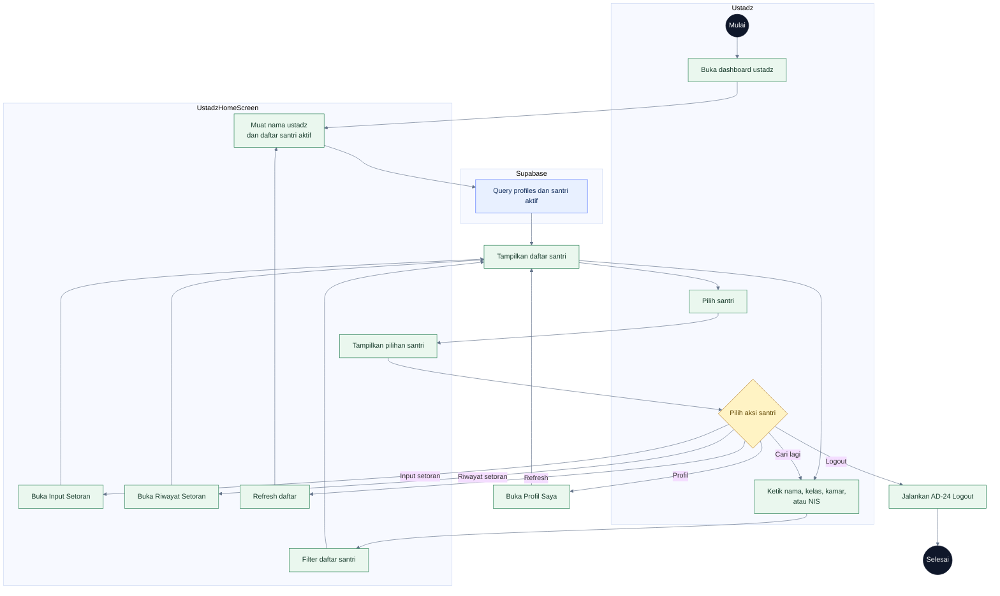
```mermaid
%%{init: {'theme': 'base', 'themeVariables': {'fontFamily': 'Inter', 'lineColor': '#64748B'}}}%%
flowchart TB
  subgraph actor["Ustadz"]
    start((Mulai)) --> open["Buka dashboard ustadz"]
    search["Ketik nama, kelas, kamar,<br/>atau NIS"]
    select["Pilih santri"]
    action{"Pilih aksi santri"}
  end
  subgraph app["UstadzHomeScreen"]
    load["Muat nama ustadz<br/>dan daftar santri aktif"]
    filter["Filter daftar santri"]
    sheet["Tampilkan pilihan santri"]
    input["Buka Input Setoran"]
    history["Buka Riwayat Setoran"]
    refresh["Refresh daftar"]
  end
  subgraph backend["Supabase"]
    query["Query profiles dan santri aktif"]
  end

  open --> load --> query --> list["Tampilkan daftar santri"]
  list --> search --> filter --> list
  list --> select --> sheet --> action
  action -- "Input setoran" --> input --> list
  action -- "Riwayat setoran" --> history --> list
  action -- "Cari lagi" --> search
  action -- "Refresh" --> refresh --> load
  action -- "Profil" --> profile["Buka Profil Saya"] --> list
  action -- "Logout" --> logout["Jalankan AD-24 Logout"] --> finish((Selesai))

  classDef start fill:#0F172A,stroke:#0F172A,color:#FFFFFF;
  classDef terminal fill:#0F172A,stroke:#0F172A,color:#FFFFFF;
  classDef action fill:#EAF7EE,stroke:#2F855A,color:#163A2A;
  classDef decision fill:#FFF3C4,stroke:#B7791F,color:#5F4500;
  classDef data fill:#E8F0FF,stroke:#4C6FFF,color:#17315F;
  class start start;
  class finish terminal;
  class open,load,list,search,filter,select,sheet,input,history,refresh,profile,logout action;
  class action decision;
  class query data;
```

## AD-13: Input setoran dan rekaman audio

Sumber alur: `lib/screens/ustadz/input_setoran_screen.dart`.

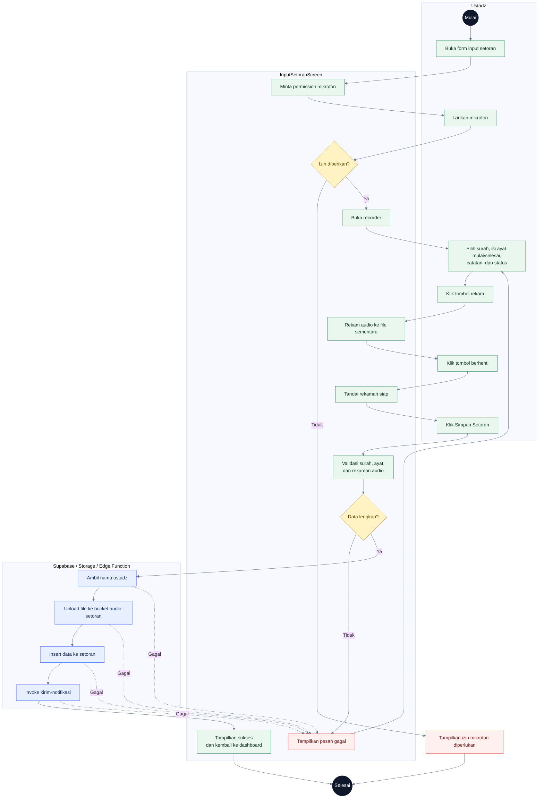
```mermaid
%%{init: {'theme': 'base', 'themeVariables': {'fontFamily': 'Inter', 'lineColor': '#64748B'}}}%%
flowchart TB
  subgraph actor["Ustadz"]
    start((Mulai)) --> open["Buka form input setoran"]
    mic["Izinkan mikrofon"]
    fill["Pilih surah, isi ayat mulai/selesai,<br/>catatan, dan status"]
    record["Klik tombol rekam"]
    stop["Klik tombol berhenti"]
    save["Klik Simpan Setoran"]
  end
  subgraph app["InputSetoranScreen"]
    request["Minta permission mikrofon"]
    allowed{"Izin diberikan?"}
    ready["Buka recorder"]
    recording["Rekam audio ke file sementara"]
    recorded["Tandai rekaman siap"]
    validate["Validasi surah, ayat,<br/>dan rekaman audio"]
    valid{"Data lengkap?"}
    success["Tampilkan sukses<br/>dan kembali ke dashboard"]
    error["Tampilkan pesan gagal"]
  end
  subgraph backend["Supabase / Storage / Edge Function"]
    profile["Ambil nama ustadz"]
    upload["Upload file ke bucket audio-setoran"]
    insert["Insert data ke setoran"]
    notify["Invoke kirim-notifikasi"]
  end

  open --> request --> mic --> allowed
  allowed -- "Tidak" --> denied["Tampilkan izin mikrofon diperlukan"] --> finish((Selesai))
  allowed -- "Ya" --> ready --> fill --> record --> recording --> stop --> recorded --> save --> validate --> valid
  valid -- "Tidak" --> error --> fill
  valid -- "Ya" --> profile --> upload --> insert --> notify --> success --> finish
  profile -. "Gagal" .-> error
  upload -. "Gagal" .-> error
  insert -. "Gagal" .-> error
  notify -. "Gagal" .-> error

  classDef start fill:#0F172A,stroke:#0F172A,color:#FFFFFF;
  classDef terminal fill:#0F172A,stroke:#0F172A,color:#FFFFFF;
  classDef action fill:#EAF7EE,stroke:#2F855A,color:#163A2A;
  classDef decision fill:#FFF3C4,stroke:#B7791F,color:#5F4500;
  classDef data fill:#E8F0FF,stroke:#4C6FFF,color:#17315F;
  classDef error fill:#FFF0F0,stroke:#E05A5A,color:#7A1E1E;
  class start start;
  class finish terminal;
  class open,mic,fill,record,stop,save,request,ready,recording,recorded,validate,success action;
  class allowed,valid decision;
  class profile,upload,insert,notify data;
  class denied,error error;
```

## AD-14: Lihat riwayat dan putar audio setoran

Sumber alur: `lib/screens/ustadz/riwayat_setoran_screen.dart` dan `lib/screens/orang_tua/home_screen.dart`.

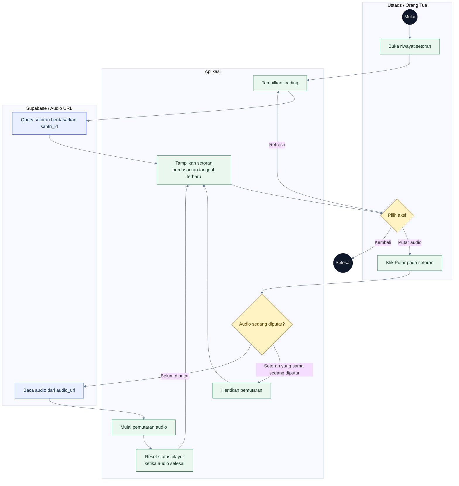
```mermaid
%%{init: {'theme': 'base', 'themeVariables': {'fontFamily': 'Inter', 'lineColor': '#64748B'}}}%%
flowchart TB
  subgraph actor["Ustadz / Orang Tua"]
    start((Mulai)) --> open["Buka riwayat setoran"]
    action{"Pilih aksi"}
    tap["Klik Putar pada setoran"]
  end
  subgraph app["Aplikasi"]
    load["Tampilkan loading"]
    list["Tampilkan setoran<br/>berdasarkan tanggal terbaru"]
    player{"Audio sedang diputar?"}
    startPlay["Mulai pemutaran audio"]
    stopPlay["Hentikan pemutaran"]
    finished["Reset status player<br/>ketika audio selesai"]
  end
  subgraph backend["Supabase / Audio URL"]
    query["Query setoran berdasarkan santri_id"]
    stream["Baca audio dari audio_url"]
  end

  open --> load --> query --> list --> action
  action -- "Putar audio" --> tap --> player
  player -- "Setoran yang sama sedang diputar" --> stopPlay --> list
  player -- "Belum diputar" --> stream --> startPlay --> finished --> list
  action -- "Refresh" --> load
  action -- "Kembali" --> finish((Selesai))

  classDef start fill:#0F172A,stroke:#0F172A,color:#FFFFFF;
  classDef terminal fill:#0F172A,stroke:#0F172A,color:#FFFFFF;
  classDef action fill:#EAF7EE,stroke:#2F855A,color:#163A2A;
  classDef decision fill:#FFF3C4,stroke:#B7791F,color:#5F4500;
  classDef data fill:#E8F0FF,stroke:#4C6FFF,color:#17315F;
  class start start;
  class finish terminal;
  class open,load,list,tap,startPlay,stopPlay,finished action;
  class action,player decision;
  class query,stream data;
```

## AD-15: Penilaian dan perubahan status setoran

Sumber alur: `lib/screens/ustadz/riwayat_setoran_screen.dart` (`PenilaianSheet`, `_updateStatus`).

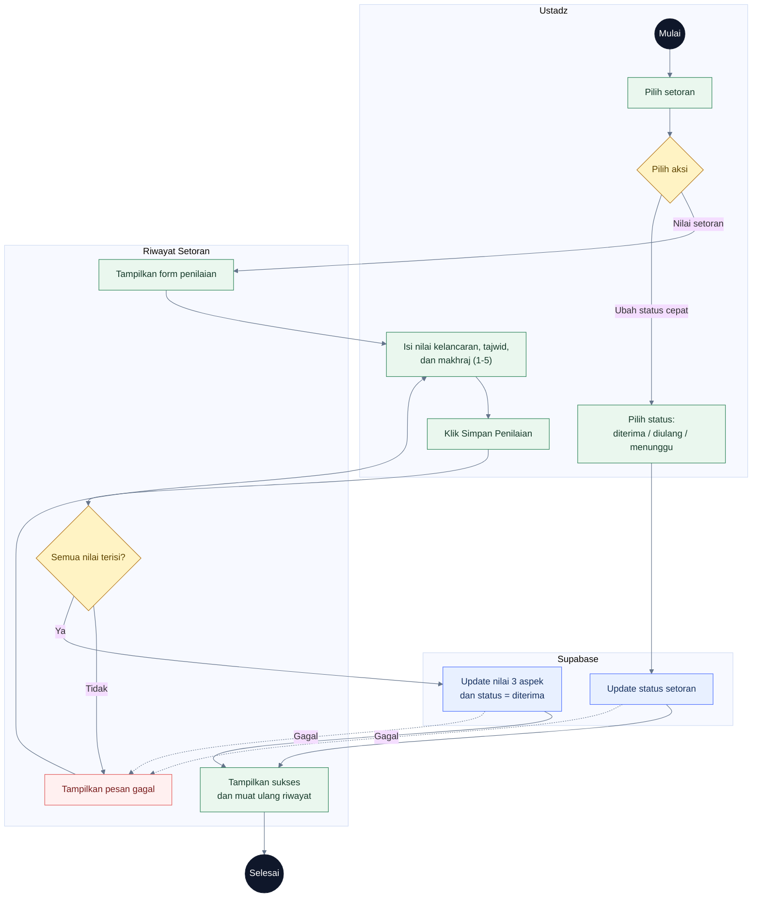
```mermaid
%%{init: {'theme': 'base', 'themeVariables': {'fontFamily': 'Inter', 'lineColor': '#64748B'}}}%%
flowchart TB
  subgraph actor["Ustadz"]
    start((Mulai)) --> choose["Pilih setoran"]
    action{"Pilih aksi"}
    rate["Isi nilai kelancaran, tajwid,<br/>dan makhraj (1-5)"]
    save["Klik Simpan Penilaian"]
    status["Pilih status:<br/>diterima / diulang / menunggu"]
  end
  subgraph app["Riwayat Setoran"]
    sheet["Tampilkan form penilaian"]
    valid{"Semua nilai terisi?"}
    reload["Tampilkan sukses<br/>dan muat ulang riwayat"]
    error["Tampilkan pesan gagal"]
  end
  subgraph backend["Supabase"]
    score["Update nilai 3 aspek<br/>dan status = diterima"]
    update["Update status setoran"]
  end

  choose --> action
  action -- "Nilai setoran" --> sheet --> rate --> save --> valid
  valid -- "Tidak" --> error --> rate
  valid -- "Ya" --> score --> reload --> finish((Selesai))
  action -- "Ubah status cepat" --> status --> update --> reload
  score -. "Gagal" .-> error
  update -. "Gagal" .-> error

  classDef start fill:#0F172A,stroke:#0F172A,color:#FFFFFF;
  classDef terminal fill:#0F172A,stroke:#0F172A,color:#FFFFFF;
  classDef action fill:#EAF7EE,stroke:#2F855A,color:#163A2A;
  classDef decision fill:#FFF3C4,stroke:#B7791F,color:#5F4500;
  classDef data fill:#E8F0FF,stroke:#4C6FFF,color:#17315F;
  classDef error fill:#FFF0F0,stroke:#E05A5A,color:#7A1E1E;
  class start start;
  class finish terminal;
  class choose,rate,save,status,sheet,reload action;
  class action,valid decision;
  class score,update data;
  class error error;
```

## AD-16: Hapus audio atau setoran

Sumber alur: `lib/screens/ustadz/riwayat_setoran_screen.dart`.

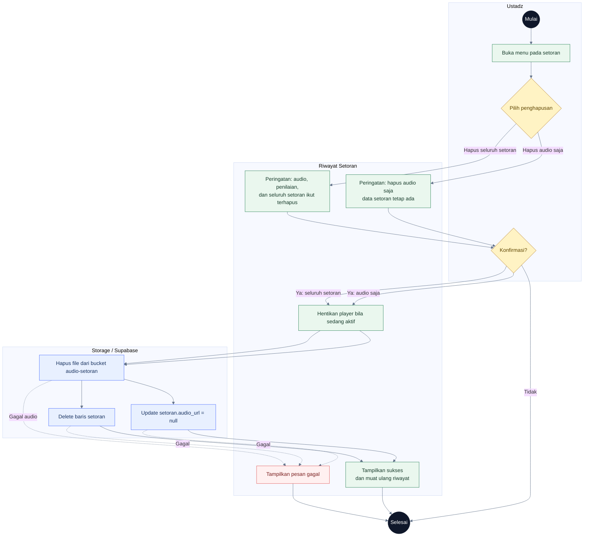
```mermaid
%%{init: {'theme': 'base', 'themeVariables': {'fontFamily': 'Inter', 'lineColor': '#64748B'}}}%%
flowchart TB
  subgraph actor["Ustadz"]
    start((Mulai)) --> choose["Buka menu pada setoran"]
    type{"Pilih penghapusan"}
    confirm{"Konfirmasi?"}
  end
  subgraph app["Riwayat Setoran"]
    audioWarn["Peringatan: hapus audio saja<br/>data setoran tetap ada"]
    setoranWarn["Peringatan: audio, penilaian,<br/>dan seluruh setoran ikut terhapus"]
    stop["Hentikan player bila sedang aktif"]
    reload["Tampilkan sukses<br/>dan muat ulang riwayat"]
    error["Tampilkan pesan gagal"]
  end
  subgraph backend["Storage / Supabase"]
    removeAudio["Hapus file dari bucket audio-setoran"]
    clearUrl["Update setoran.audio_url = null"]
    deleteRow["Delete baris setoran"]
  end

  choose --> type
  type -- "Hapus audio saja" --> audioWarn --> confirm
  type -- "Hapus seluruh setoran" --> setoranWarn --> confirm
  confirm -- "Tidak" --> finish((Selesai))
  confirm -- "Ya: audio saja" --> stop --> removeAudio --> clearUrl --> reload --> finish
  confirm -- "Ya: seluruh setoran" --> stop --> removeAudio --> deleteRow --> reload
  removeAudio -. "Gagal audio" .-> error --> finish
  clearUrl -. "Gagal" .-> error
  deleteRow -. "Gagal" .-> error

  classDef start fill:#0F172A,stroke:#0F172A,color:#FFFFFF;
  classDef terminal fill:#0F172A,stroke:#0F172A,color:#FFFFFF;
  classDef action fill:#EAF7EE,stroke:#2F855A,color:#163A2A;
  classDef decision fill:#FFF3C4,stroke:#B7791F,color:#5F4500;
  classDef data fill:#E8F0FF,stroke:#4C6FFF,color:#17315F;
  classDef error fill:#FFF0F0,stroke:#E05A5A,color:#7A1E1E;
  class start start;
  class finish terminal;
  class choose,audioWarn,setoranWarn,stop,reload action;
  class type,confirm decision;
  class removeAudio,clearUrl,deleteRow data;
  class error error;
```

## AD-17: Update progress hafalan

Sumber alur: `lib/screens/ustadz/progress_tracker_screen.dart`.

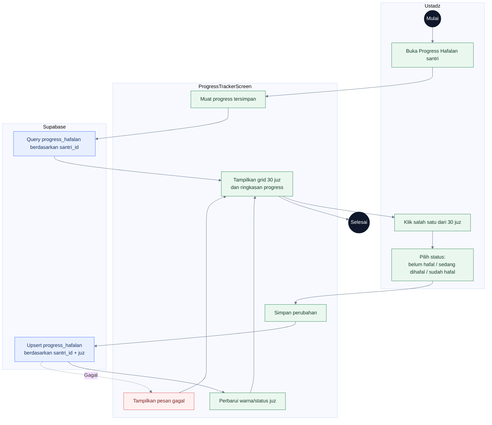
```mermaid
%%{init: {'theme': 'base', 'themeVariables': {'fontFamily': 'Inter', 'lineColor': '#64748B'}}}%%
flowchart TB
  subgraph actor["Ustadz"]
    start((Mulai)) --> open["Buka Progress Hafalan santri"]
    juz["Klik salah satu dari 30 juz"]
    status["Pilih status:<br/>belum hafal / sedang dihafal / sudah hafal"]
  end
  subgraph app["ProgressTrackerScreen"]
    load["Muat progress tersimpan"]
    grid["Tampilkan grid 30 juz<br/>dan ringkasan progress"]
    saving["Simpan perubahan"]
    success["Perbarui warna/status juz"]
    error["Tampilkan pesan gagal"]
  end
  subgraph backend["Supabase"]
    query["Query progress_hafalan berdasarkan santri_id"]
    upsert["Upsert progress_hafalan<br/>berdasarkan santri_id + juz"]
  end

  open --> load --> query --> grid --> juz --> status --> saving --> upsert --> success --> grid
  upsert -. "Gagal" .-> error --> grid
  grid --> finish((Selesai))

  classDef start fill:#0F172A,stroke:#0F172A,color:#FFFFFF;
  classDef terminal fill:#0F172A,stroke:#0F172A,color:#FFFFFF;
  classDef action fill:#EAF7EE,stroke:#2F855A,color:#163A2A;
  classDef decision fill:#FFF3C4,stroke:#B7791F,color:#5F4500;
  classDef data fill:#E8F0FF,stroke:#4C6FFF,color:#17315F;
  classDef error fill:#FFF0F0,stroke:#E05A5A,color:#7A1E1E;
  class start start;
  class finish terminal;
  class open,juz,status,load,grid,saving,success action;
  class query,upsert data;
  class error error;
```

## AD-18: Kelola target hafalan

Sumber alur: `lib/screens/ustadz/target_hafalan_screen.dart` (`FormTargetSheet`).

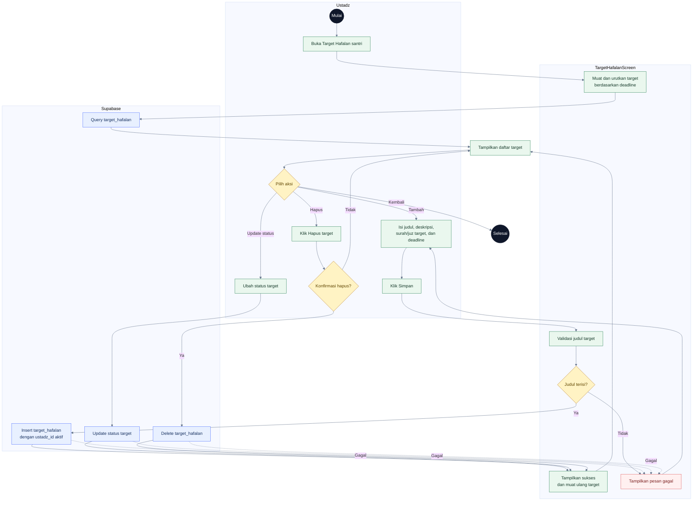
```mermaid
%%{init: {'theme': 'base', 'themeVariables': {'fontFamily': 'Inter', 'lineColor': '#64748B'}}}%%
flowchart TB
  subgraph actor["Ustadz"]
    start((Mulai)) --> open["Buka Target Hafalan santri"]
    action{"Pilih aksi"}
    fill["Isi judul, deskripsi,<br/>surah/juz target, dan deadline"]
    save["Klik Simpan"]
    status["Ubah status target"]
    delete["Klik Hapus target"]
    confirm{"Konfirmasi hapus?"}
  end
  subgraph app["TargetHafalanScreen"]
    load["Muat dan urutkan target<br/>berdasarkan deadline"]
    validate["Validasi judul target"]
    valid{"Judul terisi?"}
    reload["Tampilkan sukses<br/>dan muat ulang target"]
    error["Tampilkan pesan gagal"]
  end
  subgraph backend["Supabase"]
    query["Query target_hafalan"]
    insert["Insert target_hafalan<br/>dengan ustadz_id aktif"]
    update["Update status target"]
    remove["Delete target_hafalan"]
  end

  open --> load --> query --> list["Tampilkan daftar target"] --> action
  action -- "Tambah" --> fill --> save --> validate --> valid
  valid -- "Tidak" --> error --> fill
  valid -- "Ya" --> insert --> reload --> list
  action -- "Update status" --> status --> update --> reload
  action -- "Hapus" --> delete --> confirm
  confirm -- "Tidak" --> list
  confirm -- "Ya" --> remove --> reload
  insert -. "Gagal" .-> error
  update -. "Gagal" .-> error
  remove -. "Gagal" .-> error
  action -- "Kembali" --> finish((Selesai))

  classDef start fill:#0F172A,stroke:#0F172A,color:#FFFFFF;
  classDef terminal fill:#0F172A,stroke:#0F172A,color:#FFFFFF;
  classDef action fill:#EAF7EE,stroke:#2F855A,color:#163A2A;
  classDef decision fill:#FFF3C4,stroke:#B7791F,color:#5F4500;
  classDef data fill:#E8F0FF,stroke:#4C6FFF,color:#17315F;
  classDef error fill:#FFF0F0,stroke:#E05A5A,color:#7A1E1E;
  class start start;
  class finish terminal;
  class open,fill,save,status,delete,load,list,validate,reload action;
  class action,valid,confirm decision;
  class query,insert,update,remove data;
  class error error;
```

## AD-19: Dashboard orang tua dan notifikasi

Sumber alur: `lib/screens/orang_tua/home_screen.dart`, `lib/services/notification_service.dart`.

```mermaid
%%{init: {'theme': 'base', 'themeVariables': {'fontFamily': 'Inter', 'lineColor': '#64748B'}}}%%
flowchart TB
  subgraph actor["Orang Tua"]
    start((Mulai)) --> open["Buka dashboard orang tua"]
    refresh["Tarik untuk refresh"]
    tab["Pilih tab Notifikasi"]
    action{"Akun terhubung ke santri?"}
  end
  subgraph app["OrangTuaHomeScreen"]
    loading["Tampilkan loading"]
    showProfile["Tampilkan nama orang tua"]
    showNotif["Tampilkan badge unread<br/>dan daftar notifikasi"]
    mark["Tandai notifikasi sebagai dibaca"]
    linked["Tampilkan ringkasan santri<br/>dan tiga tab utama"]
    unlinked["Tampilkan pesan hubungi admin"]
  end
  subgraph backend["Supabase / Firebase"]
    profile["Query profiles"]
    santri["Query santri berdasarkan orang_tua_id"]
    notif["Query notifikasi maksimal 30<br/>dari yang terbaru"]
    read["Update notifikasi.dibaca = true"]
  end

  open --> loading --> profile --> santri --> notif --> showProfile --> showNotif --> mark --> read --> action
  action -- "Ya" --> linked --> tab
  action -- "Tidak" --> unlinked --> tab
  refresh --> loading
  tab -- "Notifikasi" --> showNotif
  tab -- "Setoran" --> history["Lanjut ke AD-20"]
  tab -- "Progress" --> progress["Lanjut ke AD-21"]
  tab -- "Profil" --> profilePage["Lanjut ke AD-22"]
  tab -- "Logout" --> logout["Jalankan AD-24 Logout"] --> finish((Selesai))

  classDef start fill:#0F172A,stroke:#0F172A,color:#FFFFFF;
  classDef terminal fill:#0F172A,stroke:#0F172A,color:#FFFFFF;
  classDef action fill:#EAF7EE,stroke:#2F855A,color:#163A2A;
  classDef decision fill:#FFF3C4,stroke:#B7791F,color:#5F4500;
  classDef data fill:#E8F0FF,stroke:#4C6FFF,color:#17315F;
  classDef error fill:#FFF0F0,stroke:#E05A5A,color:#7A1E1E;
  class start start;
  class finish terminal;
  class open,refresh,tab,loading,showProfile,showNotif,mark,linked,unlinked,history,progress,profilePage,logout action;
  class action decision;
  class profile,santri,notif,read data;
```

## AD-20: Riwayat, grafik, dan audio untuk orang tua

Sumber alur: `lib/screens/orang_tua/home_screen.dart`, `lib/widgets/grafik_perkembangan.dart`.

```mermaid
%%{init: {'theme': 'base', 'themeVariables': {'fontFamily': 'Inter', 'lineColor': '#64748B'}}}%%
flowchart TB
  subgraph actor["Orang Tua"]
    start((Mulai)) --> tab["Pilih tab Setoran"]
    filter["Pilih periode:<br/>7 hari / 30 hari / semua"]
    more["Klik Muat lebih banyak"]
    audio["Klik Putar Bacaan"]
    again{"Masih ingin melihat data?"}
  end
  subgraph app["OrangTuaHomeScreen + GrafikPerkembangan"]
    load["Muat daftar setoran halaman pertama"]
    display["Tampilkan grafik jumlah ayat,<br/>rata-rata nilai, dan riwayat setoran"]
    page{"Data masih tersedia?"}
    append["Ambil halaman berikutnya<br/>dan gabungkan ke daftar"]
    player{"Audio yang sama sedang diputar?"}
    stop["Hentikan audio"]
    play["Putar audio setoran"]
  end
  subgraph backend["Supabase / Audio URL"]
    setoran["Query setoran berdasarkan santri_id<br/>dengan range pagination"]
    chart["Query setoran sesuai periode<br/>untuk perhitungan grafik"]
    stream["Baca audio_url"]
  end

  tab --> load --> setoran --> display --> again
  filter --> chart --> display
  again -- "Ya, muat lagi" --> page
  page -- "Ya" --> more --> append --> setoran
  page -- "Tidak" --> again
  again -- "Ya, putar audio" --> audio --> player
  player -- "Ya" --> stop --> display
  player -- "Tidak" --> stream --> play --> display
  again -- "Tidak" --> finish((Selesai))

  classDef start fill:#0F172A,stroke:#0F172A,color:#FFFFFF;
  classDef terminal fill:#0F172A,stroke:#0F172A,color:#FFFFFF;
  classDef action fill:#EAF7EE,stroke:#2F855A,color:#163A2A;
  classDef decision fill:#FFF3C4,stroke:#B7791F,color:#5F4500;
  classDef data fill:#E8F0FF,stroke:#4C6FFF,color:#17315F;
  class start start;
  class finish terminal;
  class tab,filter,more,audio,load,display,append,stop,play action;
  class again,page,player decision;
  class setoran,chart,stream data;
```

## AD-21: Progress hafalan untuk orang tua

Sumber alur: `lib/screens/orang_tua/home_screen.dart`.

```mermaid
%%{init: {'theme': 'base', 'themeVariables': {'fontFamily': 'Inter', 'lineColor': '#64748B'}}}%%
flowchart TB
  subgraph actor["Orang Tua"]
    start((Mulai)) --> tab["Pilih tab Progress"]
    view["Melihat grid 30 juz"]
  end
  subgraph app["OrangTuaHomeScreen"]
    load["Muat progress santri"]
    calculate["Hitung jumlah juz hafal,<br/>sedang, dan belum"]
    display["Tampilkan progress bar,<br/>statistik, legenda, dan grid"]
    readonly["Progress hanya dapat dilihat"]
  end
  subgraph backend["Supabase"]
    query["Query progress_hafalan berdasarkan santri_id"]
  end

  tab --> load --> query --> calculate --> display --> view --> readonly --> finish((Selesai))

  classDef start fill:#0F172A,stroke:#0F172A,color:#FFFFFF;
  classDef terminal fill:#0F172A,stroke:#0F172A,color:#FFFFFF;
  classDef action fill:#EAF7EE,stroke:#2F855A,color:#163A2A;
  classDef data fill:#E8F0FF,stroke:#4C6FFF,color:#17315F;
  class start start;
  class finish terminal;
  class tab,view,load,calculate,display,readonly action;
  class query data;
```

## AD-22: Profil dan foto profil

Sumber alur: `lib/screens/profil/profil_screen.dart`.

```mermaid
%%{init: {'theme': 'base', 'themeVariables': {'fontFamily': 'Inter', 'lineColor': '#64748B'}}}%%
flowchart TB
  subgraph actor["Admin / Ustadz / Orang Tua"]
    start((Mulai)) --> open["Buka Profil Saya"]
    action{"Pilih aksi"}
    fill["Ubah nama dan nomor HP"]
    save["Klik Simpan Profil"]
    pick["Pilih foto dari perangkat"]
  end
  subgraph app["ProfilScreen"]
    load["Muat data profile dan email akun"]
    display["Tampilkan foto, nama, role,<br/>email, dan data pribadi"]
    validate["Validasi nama"]
    valid{"Nama terisi?"}
    size{"Ukuran foto <= 1 MB?"}
    error["Tampilkan pesan gagal"]
    success["Tampilkan sukses dan refresh profil"]
  end
  subgraph backend["Supabase / Storage"]
    profile["Query profiles"]
    upload["Upload/upsert foto ke bucket profil-foto"]
    photo["Update profiles.foto_url"]
    update["Update profiles.nama dan no_hp"]
  end

  open --> load --> profile --> display --> action
  action -- "Edit data pribadi" --> fill --> save --> validate --> valid
  valid -- "Tidak" --> error --> display
  valid -- "Ya" --> update --> success --> display
  action -- "Ganti foto" --> pick --> size
  size -- "Tidak" --> error --> display
  size -- "Ya" --> upload --> photo --> success --> display
  action -- "Ganti password" --> password["Lanjut ke AD-23"]
  update -. "Gagal" .-> error
  upload -. "Gagal" .-> error
  photo -. "Gagal" .-> error

  classDef start fill:#0F172A,stroke:#0F172A,color:#FFFFFF;
  classDef terminal fill:#0F172A,stroke:#0F172A,color:#FFFFFF;
  classDef action fill:#EAF7EE,stroke:#2F855A,color:#163A2A;
  classDef decision fill:#FFF3C4,stroke:#B7791F,color:#5F4500;
  classDef data fill:#E8F0FF,stroke:#4C6FFF,color:#17315F;
  classDef error fill:#FFF0F0,stroke:#E05A5A,color:#7A1E1E;
  class start start;
  class finish terminal;
  class open,fill,save,pick,load,display,validate,success,password action;
  class action,valid,size decision;
  class profile,upload,photo,update data;
  class error error;
```

## AD-23: Ganti password

Sumber alur: `lib/screens/profil/profil_screen.dart` (`_gantiPassword`).

```mermaid
%%{init: {'theme': 'base', 'themeVariables': {'fontFamily': 'Inter', 'lineColor': '#64748B'}}}%%
flowchart TB
  subgraph actor["Admin / Ustadz / Orang Tua"]
    start((Mulai)) --> open["Buka bagian Keamanan Akun"]
    fill["Isi password baru<br/>dan konfirmasi password"]
    save["Klik Ubah Password"]
  end
  subgraph app["ProfilScreen"]
    validate["Validasi tidak kosong, minimal 6 karakter,<br/>dan konfirmasi harus sama"]
    valid{"Input valid?"}
    clear["Kosongkan field<br/>dan tutup bagian ganti password"]
    error["Tampilkan pesan gagal"]
  end
  subgraph backend["Supabase Auth"]
    update["auth.updateUser(password baru)"]
  end

  open --> fill --> save --> validate --> valid
  valid -- "Tidak" --> error --> fill
  valid -- "Ya" --> update --> clear --> success["Tampilkan Password berhasil diubah"] --> finish((Selesai))
  update -. "Gagal" .-> error

  classDef start fill:#0F172A,stroke:#0F172A,color:#FFFFFF;
  classDef terminal fill:#0F172A,stroke:#0F172A,color:#FFFFFF;
  classDef action fill:#EAF7EE,stroke:#2F855A,color:#163A2A;
  classDef decision fill:#FFF3C4,stroke:#B7791F,color:#5F4500;
  classDef data fill:#E8F0FF,stroke:#4C6FFF,color:#17315F;
  classDef error fill:#FFF0F0,stroke:#E05A5A,color:#7A1E1E;
  class start start;
  class finish terminal;
  class open,fill,save,validate,clear,success action;
  class valid decision;
  class update data;
  class error error;
```

## AD-24: Logout

Sumber alur: `lib/widgets/konfirmasi_dialog.dart` dan dashboard tiap role.

```mermaid
%%{init: {'theme': 'base', 'themeVariables': {'fontFamily': 'Inter', 'lineColor': '#64748B'}}}%%
flowchart TB
  subgraph actor["Admin / Ustadz / Orang Tua"]
    start((Mulai)) --> tap["Klik ikon Logout"]
    confirm{"Konfirmasi keluar?"}
  end
  subgraph app["Aplikasi Flutter"]
    dialog["Tampilkan dialog Keluar Akun"]
    stay["Tutup dialog<br/>dan tetap di dashboard"]
    route["Navigasi ke LoginScreen"]
  end
  subgraph backend["Supabase Auth"]
    signout["auth.signOut"]
  end

  tap --> dialog --> confirm
  confirm -- "Tidak" --> stay --> finish((Selesai))
  confirm -- "Ya" --> signout --> route --> finish

  classDef start fill:#0F172A,stroke:#0F172A,color:#FFFFFF;
  classDef terminal fill:#0F172A,stroke:#0F172A,color:#FFFFFF;
  classDef action fill:#EAF7EE,stroke:#2F855A,color:#163A2A;
  classDef decision fill:#FFF3C4,stroke:#B7791F,color:#5F4500;
  classDef data fill:#E8F0FF,stroke:#4C6FFF,color:#17315F;
  class start start;
  class finish terminal;
  class tap,dialog,stay,route action;
  class confirm decision;
  class signout data;
```

## Catatan implementasi

- Login memakai satu `LoginScreen`; tiga diagram login di atas adalah pemisahan jalur berdasarkan nilai `profiles.role` agar mudah dipresentasikan per aktor.
- `KelolaOrangTuaScreen` saat ini seluruhnya dikomentari dan tidak ditautkan dari dashboard admin. Alur orang tua yang aktif tetap tercakup melalui pembuatan akun orang tua di `FormSantriScreen` dan `FormUserScreen(role: 'orang_tua')`.
- `buat-user`, `reset-password-user`, `kirim-notifikasi`, `delete_user`, `reset_user_password`, dan `get_user_email` digambarkan sebagai layanan backend karena implementasinya dipanggil dari aplikasi, bukan didefinisikan di folder `lib`.
- Pada `AuthGate`, sesi yang sudah ada saat ini tetap diarahkan ke `LoginScreen`; diagram AD-00 menandainya sebagai perilaku implementasi saat ini.

